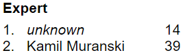
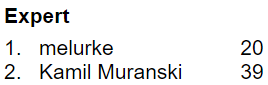

# Minesweeper

Bot that plays Minesweeper on https://minesweeperonline.com/
The game should be played with the compiler on the right half of the screen and the website on the left half.

The record for expert mode is 14 seconds, which is 25 seconds faster than the all time record before (set by a human). Unfortunately you can't see my name on the website because I got banned from showing up in the scoreboard because the bot was too fast (but here is a picture from the website directly after the record was made).

The record before that was 19 seconds:

expert.py / intermediate.py / beginner.py -> Main programs that play the game in the different difficulty levels of the site

functions.py -> Function definitions for the main program

cool_bot.py -> Bot for the beginner mode of the website trying to win with the first click

PIL_vs_PyAutoGUI.py -> Test to see if PIL can scan the field faster than PyAutoGUI (it can)
