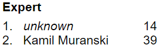
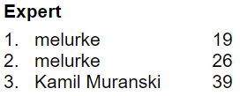

# Minesweeper

Bot that plays Minesweeper on https://minesweeperonline.com/
The coordinates for the clicks are based on the terminal on the right half of the screen and the website on the left. The webisite was opened in Chrome with 175% zoom. If other browsers, zooms or window configurations are used, the coordinates might have to be changed.

The record for expert mode is 14 seconds, which is 25 seconds faster than the all time record before (set by a human). Unfortunately you can't see my name on the website because I got banned from showing up in the scoreboard because the bot was too fast (but here is a picture from the website directly after the record was made).

The record before that was 19 seconds:

## Bots

There are three differet files for the three different difficulties on the site. They are called `expert.py`, `intermediate.py` and `beginner.py` for the modes respectively.
All of them use the `functions.py` file that contains the code all of the other programs share.

There also is the `cool_bot.py` file. This is a program that tries to win as fast as possible in beginner mode not by analyzing the field but by clicking on two fields.
Winning with this bot is only possible if by luck the game is over after these two clicks. Even though we ran this bot for several hours, it never managed to win.